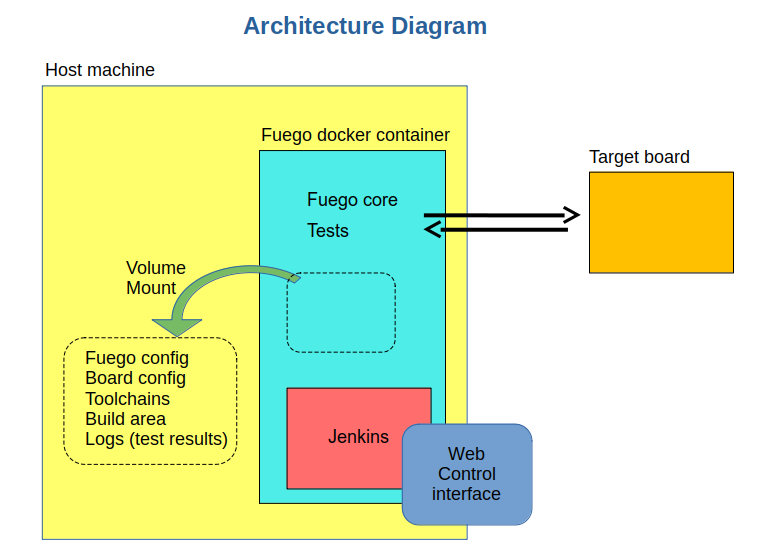
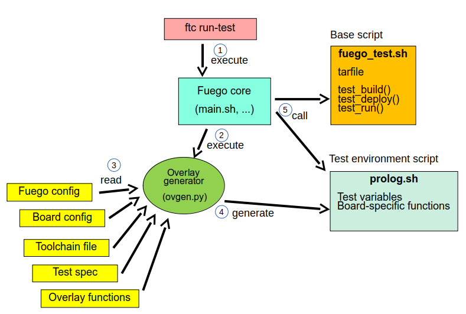

.. _architecture:

################
Architecture
################

Fuego consists of a continuous integration system, along
with some pre-packaged test programs and a shell-based
test harness, running in a Docker container.::

   Fuego = (Jenkins + core scripts + pre-packaged tests)
          inside a container

Here's a diagram with an overview of Fuego elements:

=================
Major elements
=================

The major elements in the Fuego architecture are:

 * Host system

   * Fuego container instance

     * Jenkins continuous integration system

       * Web-based user interface (web server on port 8090)
       * Jenkins Plugins

     * Fuego core system
     * Fuego tests
     * Build environment
     * Test results directory

 * Target board(s)
 * Fuego command line tool (not shown in the diagram above)
 * Web client, for interacting with the system (not provided and not shown)

==========================
Container
==========================

By default, Fuego runs inside a Docker container, which is created when
Fuego is installed.  Using a container makes it is easier to install and
use Fuego on a variety of different Linux distributions.  The libraries
and packages that Fuego needs are included in the docker container, and
don't need to be installed separately.  These packages have fixed
versions, and don't interfere with versions of the same packages that
may already be present on the host system where Fuego is installed.

==============
Jenkins
==============

The main user interface for Fuego is provided by the Jenkins continuous
integration system.

Jenkins is used in Fuego to launch test jobs and view test results.
Usually, Fuego tests are started by Jenkins automatically, in response
to changes in the software.  However, Jenkins can be configured to launch
test jobs based on a variety of triggers, including when a user manually
schedules a test to run, or at periodic intervals.

Jenkins is too big a system to describe in detail here, but it has
many features and is very popular.  It has an ecosystem of plugins for
many kinds of extended functionality, such as integration with
different source code management systems, results plotting, e-mail
notifications of regressions, and more.

Fuego installs several plugins that are used by various aspects of the
system.  You can install additional plugins to Jenkins to suit
your own requirements.

In Fuego, Jenkins is used to:

 * Start tests
 * Schedule tests for automatic execution
 * Shows test results (particularly over time)
 * Flag regressions in test results

When using Jenkins with Fuego, the Fuego administrator will add Jenkins
objects (nodes and jobs) that are representative of Fuego objects.  Once
these objects are defined, Jenkins can then start a Fuego job.  It does
this by calling Fuego's ``ftc`` command.

The interface between Jenkins and the Fuego system is documented at
:ref:`Core interfaces <core_interfaces>`.

=========================
Pre-packaged tests
=========================

Fuego contains over 100 pre-packaged tests, ready for you to start
testing "out-of-the-box".  There are tests of individual programs or
features, such as 'iputils' or 'pmqtest', as well as several benchmarks
in the areas of CPU performance, networking, graphics, and realtime.
Fuego also includes some full test suites, like LTP (Linux Test Project).
Finally, Fuego includes a set of selftests, to validate board
operation or core Fuego functionality.

=========================
Fuego test definition
=========================

Fuego defines a test using a collection of files, which handle
different aspects of test definition and execution.

The major elements of a Fuego test are:

 * a test definition file, which has information about the test
 * a "base script", which manages test execution (``fuego_test.sh``)
 * a "spec" file, that contains information about test variants
 * a test program, to perform the actual test
 * a parser, to convert test program output to individual testcase
   results

Some other files that a test might include are:

 * a criteria file, for evaluating test results
 * a chart config file, that controls which test results are output
   and in what format, in the Jenkins user interface

Base script vs test program
=============================
Fuego tests often provide a build sytem and host/target wrapper
for existing test programs (such as Dhrystone, dbench or cyclictest).

In cases like this, part of the Fuego code runs on the host system,
and part runs on the device under test.  More specifically, the
base script (``fuego_test.sh``) is run on the host machine, inside
the Fuego docker container.  The test program (e.g. the actual
dhrystone executable) is run on the target board.

Because of this setup, it can be confusing what the words "test",
or "test script", "test program", or the name of the test
(e.g. Dhrystone) refers to.

In order to avoid confusion, this documentation refers to the software
that runs on the target board (or "device under test") as the "test
program" (always including the word 'program').  The documentation uses
the full name of the test (such as 'Benchmark.Drhystone'), to refer to
the full set of materials used by Fuego to define a test.  And it
use the term "base script", to refer specifically to
the 'fuego_test.sh' script inside a test.

As an example, for Fuego's ``Benchmark.Dhrystone`` test, the following
nomenclature would be used:

 * 'test' or 'dhrystone test', or 'Benchmark.Dhrystone' = the full set
   of files that comprise the Fuego Dhrystone test.
 * 'base script' = ``fuego_test.sh``
 * 'test program', or 'dhrystone program' = the dhrystone executable

.. note:: This documentation uses the terminology "test program"
   to refer to the software that is executed on the target board.
   However, it should be noted that while the test program is often
   a compiled program, it could be an interpreted script (such as
   a shell script).  The phrase "test program" in this
   documentation does not imply that the program is always a
   binary object.

   Not every Fuego test includes a 'test program'.  Some Fuego tests
   execute commands on the target board directly from the base script
   (running on the host) without placing any separate or additional
   program on the board.

===========================
 Board
===========================

Fuego performs testing using a host/target
configuration for building, deploying and executing tests.

Fuego executes tests on physical hardware that is accessible
from the host on which Fuego is installed.  The physical hardware
being tested is referred to as the "target board", or the "device under
test".

During Fuego installation, the Fuego administer configures how Fuego
accesses and controls the board by creating a board configuration file.
Fuego can be configured with an arbitrary number of boards on which
to run tests.  As a special case, the administrator can also configure
Fuego to treat the host system as a board (for self-testing).

Board requirements
===========================

The board might be physically connected to the host (e.g. by a serial or
USB cable) or not.  Fuego requires very little on the target board.  It
only requires that the target board have a POSIX shell and a few system
utilities, as well as the capability to copy files to and from the
board, and the ability to remotely execute commands on the board.

Many
embedded Linux devices can satisfy these requirements with just the
'busybox' program and a serial or ssh connection.

Many Linux test systems assume that the system-under-test is a full
desktop or server system, with sufficient horsepower to build tests and
run them locally.  Fuego assumes the opposite - that embedded targets
may be underpowered and may not have the utilities and tools needed for
building and executing tests.

=========================
 Fuego core
=========================

The Fuego core consists of shell scripts (including
``main.sh``) and python code that loads the data and functions
for the test.  Fuego also provides a command line tool, called ``ftc``
that is used to perform administration and management functions.

Test Functions
==============

Fuego provides a library of functions (in the form of shell script code),
that are used by a Fuego test to perform test operations in a way that is
independent of the architecture, physical connection, or
Linux distribution of the device under test.

Some of the operations that can be performed by these functions are:

 * Building test programs from source
 * Copying files to and from the target board
 * Deploying test programs to the target board (installing them)
 * Executing the test programs
 * Reading the test log
 * Parsing the log to determine pass or fail conditions for tests
 * Parsing the log for results to display in charts

By using this library of functions, Fuego tests are insulated
from the different hardware and access methods used to manage a board in
a particular test lab.  For example, the Fuego core and the base script
for a Fuego test do not have to "know" whether a board is controlled via
serial console, ssh, or some other target agent.  These are configured
via the board configuration file and Fuego overlay system, such that the
tests themselves are independent of these details.

============================
 Different objects in Fuego
============================

It is useful to give an overview of the major objects used in Fuego,
as they will be referenced in this documentation:

Fuego core objects:

 * board - a description of the device under test
 * test - materials for conducting a test
 * spec - one or more sets of variables for describing a test variant
 * run - the results from a individual execution of a test on a board

Jenkins objects:

 * node - the Jenkins object corresponding to a Fuego board
 * job - a Jenkins object corresponding to a combination of board,
   spec, and test
 * build - the test results, from Jenkins perspective. This corresponds
   to a Fuego 'run'

Fuego consists of both a front-end and a back-end.  To avoid confusion,
different names are used to describe the front-end and back-end objects
used by the system.  Jenkins is the front-end, and the Jenkins objects
have rough counterparts in the Fuego core, as follows:

   +------------------+-------------------------------+
   | Jenkins object   | Corresponding Fuego object    |
   +==================+===============================+
   | node             | board                         |
   +------------------+-------------------------------+
   | job              | test                          |
   +------------------+-------------------------------+
   | build            | run                           |
   +------------------+-------------------------------+

=======================
 Jenkins operations
=======================
This section explains how Jenkins works as part of Fuego.

 * When a test job is initiated, Jenkins starts a slave process to run
   the test that corresponds to that job
 * The slave (slave.jar) runs a small shell script fragment, that is
   specified in the configuration (config.xml) for the job

   * This script runs the ``ftc run-test`` command.

     * ``ftc`` executes the Fuego core that does the actual
       building, deploying and execution of a test.

     * Details of the core execution of the test are described below
       in the `Test execution`_ section.

 * While a test is running, Jenkins accumulates the log output from
   the test execution, and displays it to the user (if they are
   watching the console log)

 * Jenkins provides a web UI for browsing the nodes, jobs, and test
   results (builds), and displaying graphs for benchmark data.

By default, Jenkins is installed as part of the Fuego system.  However,
it is possible to use Fuego without using Jenkins, by calling
the Fuego command line tool (``ftc``) directly from your own
testing infrastructure or CI system (e.g. gitlab).

======================
 Test execution
======================

This section describes the major elements and operations of the Fuego
core when a test is executed.

When a test is started, Fuego generates a test environment,
consisting of variables and funtions from the core system, using
something called the overlay generator.  The test environment
is placed into a file called ``prolog.sh``
and loaded into the currently running shell environment.

Details of the test environment generation are described below.

Each Fuego test has a base script, called ``fuego_test.sh``, that
defines a few functions with operations that are specific to that test
The base script is also loaded into the currently running shell
environment.

The Fuego core performs the test using variables
and calling functions from: 1) the Fuego core, 2) ``prolog.sh``
(the test environment), and 3) ``fuego_test.sh`` (the base script).

A Fuego test is executed in a series of phases which perform different
operations during the test.  The most critical operation is running the
actual test program on the board.  Specifically, the Fuego core calls
the base script's ``test_run`` function, which executes the test program
on the board and collects its output.

The Fuego core also collects additional information from the board, and
cleans up after the test. Finally, the Fuego core analyzes the test output,
by parsing the test logs, and generates data files containing test
results.

=================================
Test environment file generation
=================================
At the start of test execution, Fuego gathers information from the
Fuego system and creates a test environment file.

Information from the board configuration file (and other sources) is
used to create variables and functions that are specific to the current
test invocation and the board under test.  These are placed into the
test environment file, which is called ``prolog.sh`` and located in the
test's log directory.  These items are them used during text execution.

This operation is referred to as "overlay generation", because some of
the variables and functions come from class files that can have their
values overridden (or "overlay"ed) by elements of the board
configuration file.

 * The overlay generator takes the following as input:

   * Environment variables passed by Jenkins and ftc
   * The board configuration file
   * The toolchain configuration file
   * The test spec for the test
   * The overlay class files

Fuego uses the variables TOOLCHAIN, DISTRIB, TRANSPORT, and BOARD_CONTROL
in the board configuration file to determine the
variables and functions to include in the test environment file.

====================
Fuego test phases
====================

Fuego runs through a series of well-defined phases during test
execution.  The reason for having distinct phases is that it allows for
easier debugging of test execution, during the development of a test.
Some of the test phases are optional, and a user can manually control
which individual phases of a test are executed. Also, the user can control
which phases show extra debug information during a test.

The major test phases are:

 * pre_test
 * build
 * deploy
 * run
 * post_test
 * processing

Each of these are described in the sections after this diagram.

.. image:: ../images/fuego-test-phases.png
    :width: 600

pre_test
============

The pre_test phase consists of making sure the target is booted and
running, and preparing the workspace for the test.  In this phase test
directories are created, and the kernel version on the target board is
recorded.

The 'before' syslog is created, and filesystems are synced and buffer
caches dropped, in preparation for any filesystem tests.

If the function "test_pre_check" is defined in the base script, it is
called to do any pre_test operations, including checking to see if
required variables are set, programs or features are available on the
host or target board, or whether any other test dependencies are met.

If the dependencies are not met, the test is aborted at this phase,
with a result of ERROR and messages indicating the reason for the
failure.

build
==========

During this phase, the test program source is installed on the host
(inside a build area in the container), and the software for the test is
actually built.  The toolchain specified by TOOLCHAIN is used to build
the software.

The source code may be provided in the form of a tarball file, or
it may be specified by the test as a reference to a git repository.

This phase is split into multiple parts:

 * pre_build - build workspace is created, a build lock is acquired
   and the tarball is unpacked

   * The ``unpack`` function is called during pre_build.  This function
     unpacks the source tar file, if one is associated with this test

 * test_build - the test_build function from fuego_test.sh is called

   * usually this consists of 'make', or 'configure ; make'

 * post_build - (empty for now)

deploy
=========

The purpose of this phase is to copy the test programs, and any
required supporting files, to the target.

This consists of 3 sub-phases:

 * pre_deploy - cd's to the build directory
 * test_deploy - the base script's 'test_deploy' function is called.

   * Usually this consists of tarring up needed files, copying them to
     the target with 'put', and then extracting them there
   * Items should be placed in the directory
     ``$BOARD_TESTDIR/fuego.$TESTDIR`` directory on the target
 * post_deploy - removes the build lock

run
=======

In this phase the test program on the target board is actually executed.

This executes the 'test_run' function defined in the base script for
the test, which usually consists of one or more calls to the
``report`` function, which executes the test program on the target
board and collects the standard out from the program.
This output is saved as the testlog for the test.
Note that the ``report`` function saves the testlog on the target.
It is collected from the target later, for post-processing.

The run phase may include additional commands to prepare the system
for test operation and clean up after the execution of the
test program.

post_test
==================

In this phase, the test log is retrieved (fetched) from the target and
stored on the host.  Also in this phase, the board is "cleaned up",
which means that test directories and logs are removed on the target
board, and any leftover processes related to this test that are
running on the board are stopped.

processing
==================

In the processing phase of the test, the results from the test log are
evaluated. The test_processing function of the base test script is
called.

For functional tests:

Usually, this phase consists of one or more calls to 'log_compare', to
determine if a particular string occurs in the testlog.  This phase
determines whether the test passed or failed, and the base test script
indicates this (via it's exit code) to the Jenkins interface.

For benchmarking tests:

This phase consists of parsing the testlog, using parser.py, and also
running dataload.py to save data for plot generation.

Also, a final analysis is done on the system logs is done in this step
(to detect things like Kernel Oopses that occurred during the test).

phase relation to base script functions
============================================================

Some of the phases are automatically performed by Fuego, and some end
up calling a routine in the base script (or use data from the base
script) to perform their actions.  This table shows the relation
between the phases and the data and routines that should be defined
in the base script.

It also shows the most common commands utilized by base script
functions for this phase.

  +------------+-------------------------------+------------------------------+
  | phase      | relationship to base script   | common operations            |
  +============+===============================+==============================+
  | pre_test   | calls 'test_pre_check'        | assert_define, is_on_target, |
  |            |                               | check_process_is_running     |
  +------------+-------------------------------+------------------------------+
  | build      | uses the 'tarfile' definition,| patch, configure, make       |
  |            | calls'test_build'             |                              |
  +------------+-------------------------------+------------------------------+
  | deploy     | Calls 'test_deploy'           | put                          |
  +------------+-------------------------------+------------------------------+
  | run        | calls 'test_run'              | cmd, report, report_append   |
  +------------+-------------------------------+------------------------------+
  | post_test  | calls 'test_cleanup'          | kill_procs                   |
  +------------+-------------------------------+------------------------------+
  | processing | calls 'test_processing'       | log_compare                  |
  +------------+-------------------------------+------------------------------+

Other scripts and programs
==============================

 * ``parser.py`` - for parsing test results
 * ``criteria.json`` - for analyzing test results

A test might also include a file called ``parser.py``.  In fact, every
benchmark test should have one.  This file is a python module which is
run to extract results and data values from the log.

This script is run inside the docker container, after a test is
finished.  The Fuego log parsing system loads this module as
part of test processing.

A benchmark program measures some attribute of the system during a test,
and produces one or more values called 'metrics'.  These values are
emitted by the benchmark test into the test log, and the Fuego parser
retrieves these values and uses them to evaluate the pass/fail status of
the benchmark.  These values are saved as part of the test results, and
are used by plotting software to show charts of test results in the
Jenkins interface.

Tests may also include a file called ``criteria.json`` which is used to
determine whether test results constitute a pass or fail result.  For
example, for benchmark tests, the system can collect a number from the
test program, but it is up to the system to determine whether that
number represents an acceptable value (pass), or a failure or regression
(fail).  The ``criteria.json`` file has data about metric thresholds,
for benchmark tests, and about test results that can be ignored, for
functional tests, to allow for automating this results processing.

=====================
 Command line tool
=====================

Fuego includes a command line tool for performing administrative
and management operations, and for executing tests.  This command
line tool is called ``ftc``.  Details of ``ftc`` commands can
be found in the section :ref:`Command Line Tool <command_line_tool>`.
