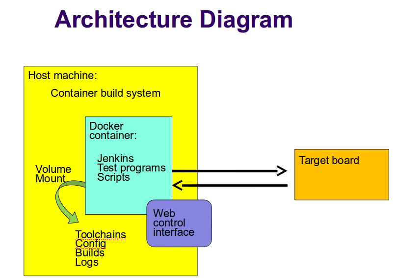

.. _architecture:

################
Architecture
################

Fuego consists of a continuous integration system, along
with some pre-packaged test programs and a shell-based
test harness, running in a Docker container.::

   Fuego = (Jenkins + abstraction scripts + pre-packed tests)
          inside a container

Here's a diagram with an overview of Fuego elements:

=================
Major elements
=================

The major elements in the Fuego architecture are:

 * Host system

   * Container build system
   * Fuego container instance

     * Jenkins continuous integration system

       * Web-based user interface (web server on port 8090)
       * Plugins

     * Test programs
     * Build environment (not shown in the diagram above)
     * Fuego core system

 * Target system
 * Web client, for interaction with the system

==============
Jenkins
==============

The main interface for Fuego is provided by the Jenkins continuous
integration system.

The basic function of Jenkins is to automatically launch test jobs,
usually in response to changes in the software.  However, it can
launch test jobs based on a variety of triggers, including when a user
manually schedules a test to run.

Jenkins is too big a system to describe in detail here, but it has
many features and is very popular.  It has an ecosystem of plugins for
all kinds of extended functionality, such as integration with
different source code management systems, results plotting, e-mail
notifications of regressions, and more.

Fuego installs several plugins that are used by various aspects of the
system.

Jenkins is used to:
 * Start tests
 * Schedule tests for automatic execution
 * Shows test results (particularly over time)
 * Flag regressions in test results

Note that the interface between Jenkins and the test programs is
provided by a set of scripts (one per test, along with a set of
scripts that comprise the core of the system) written in shell script
language.

The interface between Jenkins and these core scripts is documented at
:ref:`Core interfaces <coreinterface>`.

This overall architecture means that when items are added into the
system (for example boards, toolchains, or tests), information has to
be supplied to both systems (the Jenkins system and the core script
system).

=========================
Pre-packaged tests
=========================
Fuego contains over 100 pre-packages tests, ready for you to
start testing with these tests "out-of-the-box".  There are
tests of individual programs or features, such as 'iputils' or
'pmqtest', as well as several benchmarks in the areas of
CPU performance, networking, graphics, and realtime. Fuego
also incluse some full test suites, like LTP (Linux Test
Project).  Finally, Fuego includes a set of selftest tests,
to validate board operation or core Fuego functionality.

=========================
Abstraction scripts
=========================

Fuego uses a set of shell script fragments to support abstractions for

 * Building test programs from source,
 * Deploying them to target (installing them)
 * Executing the tests
 * Copying files to and from the target
 * Reading the test log
 * Parsing the log to determine pass or fail conditions for tests
 * Parsing the log for results to display in charts

==========================
Container
==========================

By default, Fuego runs inside a Docker container.  This provides two
benefits:

 * It makes it easy to run the system on a variety of different Linux
   distributions
 * It makes the build environment for the test programs consistent

===========================
 Hardware configuration
===========================

Fuego supports testing of embedded Linux by fully supporting a
host/target configuration for building, deploying and executing tests.

Many Linux test systems assume that the system-under-test is a full
desktop or server system, with sufficient horsepower to build tests
and run them locally.  Fuego assumes the opposite - that embedded
targets will be underpowered and may not have the normal complement of
utilities and tools available for performing tests

============================
Different objects in Fuego
============================

It is useful to give an overview of the major objects used in Fuego,
as they will be referenced many times:

Fuego core objects:

 * board - a description of the device under test
 * test - materials forconducting a test
 * spec - one or more sets of variables for describing a test variant
 * plan - a collection of tests, with additional test settings for
   their execution
 * run - the results from
   a individual execution of a test on a board

Jenkins objects:

 * node - the Jenkins object corresponding to a Fuego board
 * job - a Jenkins object corresponding to a combination of board,
   spec, and test
 * build - the test results, from Jenkins perspective - corresponding
   to a Fuego 'run'

There are both a front-end and a back-end to the system, and different
names are used to describe the front-end and back-end objects used by
the system, to avoid confusion.  In general, Jenkins objects have
rough counterparts in
the Fuego system:

   +------------------+-------------------------------+
   | Jenkins object   | corresponds to fuego object   |
   +==================+===============================+
   | node             | board                         |
   +------------------+-------------------------------+
   | job              | test                          |
   +------------------+-------------------------------+
   | build            | run                           |
   +------------------+-------------------------------+

=======================
 Jenkins operations
=======================
This section explains how Jenkins works as part of Fuego.

 * When the a job is initiated, Jenkins starts a slave process to run
   the test that corresponds to that job
 * Jenkins records stdout from slave process
 * The slave (slave.jar) runs a script specified in the config.xml for
   the job

   * This script sources functions from the scripts and overlays
     directory of Fuego, and does the actual building, deploying and
     test executing
   * Also, the script does results analysis on the test logs, and
     calls the post_test operation to collect additional information
     and clean up after the test

 * While a test is running, Jenkins accumulates the log output from
   the generated test script and displays it to the user (if they are
   watching the console log)

 * Jenkins provides a web UI for browsing the nodes, jobs, and test
   results (builds), and displaying graphs for benchmark data

======================
 Fuego operations
======================

This section explains how the Fuego core system works to execute
tests and analyze results.

======================
Test execution
======================

 * Each test has a base script, that defines a few functions specific
   to that test (see below)
 * Upon execution, this base script loads additional test variables
   and function definitions from other files using something called
   the overlay generator
 * The overlay generator creates a script containing test variables
   for this test run

   * The script is created in the log directory for the test
   * The script is called prolog.sh
   * The overlay generator is called ovgen.py

 * The base script (with the test variable script sourced into it)
   runs on the host, and uses Fuego functions to perform different
   phases of the test
 * For a flow graph of normal test execution see:
   :ref:`test execution flow outline <Outline>`

================================
Test variable file generation
================================

 * The generator takes the following as input:

   * environment variables passed by Jenkins
   * board file for the target (specified with NODE_NAME)
   * tools.sh (vars from tools.sh are selected with TOOLCHAIN, from
     the board file)
   * the distribution file, and (selected with DISTRIB)
   * test specs for the test

The generator creates a file containing test variables,
called ``prolog.sh`` and it is placed in
the the log directory for the test (also referred to as
the "run" directory).  This generation happens on the
host, inside the docker container.  Besides variable definitions,
the test variable file has functions which are called by the
test during test execution.

Input
======

 * input descriptions:

   * the board file has variables defining attributes of the board,
     like the toolchain, network address, method of accessing the
     board, etc.
   * tools.sh has variables which are used for identifying the
     toolchain used to build binary test programs

     * it uses the TOOLCHAIN variable to determine the set of
       variables to define

   * a testplan lists multiple tests to run

     * it specifies a test name and spec for each one

     * a spec files hold the a set of variable declarations which are
       used by the tests themselves.
       These are put into environment variables on the target.

 * ovgen.py reads the plans, board files, distrib files and specs,
   and produces
   a single prolog.sh file that has all the information for the test

 * Each test in the system has a Fuego shell script, called
   ``fuego_test.sh``

 * Most (but not all) tests have an additional test program

   * this program is executed on the board (the device under test)
   * it is often a compiled program, or set of programs
   * it can be a simple shell script
   * it is optional - sometime the base script can execute the needed
     commands for a test without an additional program placed on the
     board

 * the base script declares the tarfile for the test, and has
   functions for: test_build(), test_deploy() and test_run()

   * the test script is run on host (in the container)

     * but it can include commands that will run on the board

   * tarball has the tarfile
   * test_build() has commands (which run in the container) to compile
     the test program
   * test_deploy() has commands to put the test programs on the target
   * test_run() has commands to define variables, execute the actual
     test, and log the results.

 * the test program is run on the target

   * this is the actual test program that runs and produces a result

====================
Fuego test phases
====================

A test execution in fuego runs through several phases, some of which
are optional, depending on the test.

The test phases are:
 * pre_test
 * build
 * deploy
 * run
 * fetch
 * processing
 * post_test

Each of these are described below the diagram.

.. image:: ../images/fuego-test-phases.png
    :width: 600

pre_test
============

The pre_test phase consists of making sure the target is alive, and
preparing the workspace for the test.  In this phase test directories
are created, and the firmware (a string describing the software on the
target) are collected.

The 'before' syslog is created, and filesystems are synced and buffer
caches dropped, in preparation for any filesystem tests.

If the function "test_pre_check" is defined in the base script, it is
called to do any pre_test operations, including checking to see if
required variables are set, programs or features are available on the
host or target board, or whether any other test dependencies are met.

build
==========

During this phase, the test program source is installed on the host
(inside the container), and the software for the test is actually
built.  The toolchain specified by PLATFORM is used to build the
software.

This phase is split into multiple parts:
 * pre_build - build workspace is created, a build lock is acquired
 * and the tarball is unpacked

   * :ref:`unpack <unpack>` is called during pre_build
 * test_build - this function, from the base script, is called

   * usually this consists of 'make', or 'configure ; make'
 * post_build - (empty for now)

deploy
=========

The purpose of this phase is to copy the test programs, and any
required supporting files, to the target.

This consists of 3 sub-phases:
 * pre_deploy - cd's to the build directory
 * test_deploy - the base script's 'test_deploy' function is called.

   * Usually this consists of tarring up needed files, copying them to
     the target with 'put', and then extracting them there
   * Items should be placed in the directory
     $BOARD_TESTDIR/fuego.$TESTDIR/ directory on the target
 * post_deploy - removes the build lock

run
=======

In this phase the test program on the target is actually executed.

This executes the 'test_run' function defined in the base script for
the test, which can consist of anything.  Usually, however, it runs
the test program with any needed parameters (as specified by the test
specs and test plans).

The test execution is usually performed by calling the 'report'
function, which collects the standard out from the command execution
on the target, and saves that as the testlog for the test.  Note that
the testlog is saved on the target, but not yet transferred to the
host, yet.

post_test
==================

In this phase, the test log is retrieved (fetched) from the target and
stored on the host.  Also in this phase, the board is "cleaned up",
which means that test directories and logs are removed on the target
board, and any leftover processes related to this test that are
running on the board are stopped.

processing
==================

In the processing phase of the test, the results from the test log are
evaluated. The test_processing function of the base test script is
called.

For functional tests:

Usually, this phase consists of one or more calls to 'log_compare', to
determine if a particular string occurs in the testlog.  This phase
determines whether the test passed or failed, and the base test script
indicates this (via it's exit code) to the Jenkins interface.

For benchmarking tests:

This phase consists of parsing the testlog, using parser.py, and also
running dataload.py to save data for plot generation.

Also, a final analysis is done on the system logs is done in this step
(to detect things like Kernel Oopses that occurred during the test).

phase relation to base script functions
============================================================

Some of the phases are automatically performed by Fuego, and some end
up calling a routine in the base script (or use data from the base
script) to perform their actions.  This table shows the relation
between the phases and the data and routines that should be defined
in the base script.

It also shows the most common commands utilized by base script
functions for this phase.

  +------------+-------------------------------+-----------------------------+
  | phase      | relationship to base script   | common operations           |
  +============+===============================+=============================+
  | pre_test   | calls 'test_pre_check'        |assert_define, is_on_target, |
  |            |                               |check_process_is_running     |
  +------------+-------------------------------+-----------------------------+
  | build      | uses the 'tarfile' definition,| patch, configure, make      |
  |            | calls'test_build'             |                             |
  +------------+-------------------------------+-----------------------------+
  | deploy     | Calls 'test_deploy'           | put                         |
  +------------+-------------------------------+-----------------------------+
  | run        | calls 'test_run'              | cmd, report, report_append  |
  +------------+-------------------------------+-----------------------------+
  |get_testlog | (none)                        |                             |
  +------------+-------------------------------+-----------------------------+
  |processing  | calls 'test_processing'       | log_compare                 |
  +------------+-------------------------------+-----------------------------+
  |post_test   | calls 'test_cleanup'          | kill_procs                  |
  +------------+-------------------------------+-----------------------------+

Other scripts and programs
==============================

 * ``parser.py`` - for parsing test results
 * ``criteria.json`` - for analyzing test results

A test might also include a file called ``parser.py``.  In fact, every
benchmark test should have one.  This file is a python module which is
run to extract results and data values from the log.

This script is run inside the docker container, after a test is
finished.  The Fuego log parsing system (in python) loads this module as
part of test processing.

A benchmark program measures some attribute of the system during a test,
and produces one or more values called 'metrics'.  These values are
emitted by the benchmark test into the test log, and the Fuego parser
retrieves these values and uses them to evaluate the pass/fail status of
the benchmark.  These values are saved as part of the test results, and
are used by plotting software to show charts of test results in the
Jenkins interface.

Tests may also include a file called ``criteria.json`` which is used to
determine whether test results constitute a pass or fail result.  For
example, for benchmark tests, the system can collect a number from the
test program, but it is up to the system to determine whether that
number represents an acceptable value (pass), or a failure or regression
(fail).  The ``criteria.json`` file has data about metric thresholds,
for benchmark tests, and about test results that can be ignored, for
functional tests, to allow for automating this results processing.

==============
 Data Files
==============

There are data files with definitions for several things in the system.

The Jenkins interface needs to know about boards, running test
processes (slaves), test definitions, and test results.

The fuego core needs to know about test definitions, boards, platforms
(SDKS), test plans, and test specs.

The core executes the test script for a test, executing the test
phases in sequence: build the test program, bundle the test programs
for the target, deploy them, execute the test, then post-process the
the test.

The base shell script should:

 * build the test program
 * deploy the test bundle to the target
 * execute the tests
 * read the log data from the test

The base shell script can handle host/target tests (because it runs on
the host). That is, tests that involve actions on both the host and
target.

To add a new test, the user defines several files and puts them into
/fuego-core/engine/tests

The 'ftc' command uses this directory and the directory
'/fuego-ro/boards' to show available boards and tests on the command
line.  Then a user can populate the nodes and jobs in Jenkins, using
'ftc' commands. Each test has to have a front-end entry (a Jenkins job
definition) to allow Jenkins to execute it.  This front-end entry
specifies the board, spec and base script for the test.

========
Roles
========

Human roles:
 * test program author - person who creates a new standalone test
   program
 * test integrator - person who integrates a standalone test into
   fuego
 * fuego developer - person who modifies Fuego (including the fuego
   system scripts or Jenkins) to support more test scenarios or
   additional features
 * tester - person who executes tests and evaluates results

