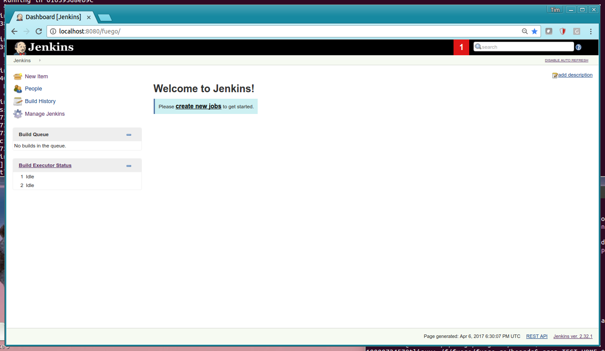

.. _installfuego:

###################
Installing Fuego
###################

This page describes the steps to install Fuego on your Linux machine.
It includes detailed descriptions of the operations, for both users
and developers.

.. Tip:: If you are interested in a quick outline of steps, please see
   the :ref:`Fuego Quickstart Guide <quickstart_guide>` instead.

===========
Overview
===========

The overview of the steps is:

 1. Install pre-requisite software
 2. Download the Fuego repository
 3. Build your Fuego container
 4. Start the container
 5. Access the Jenkins interface

=================================
Install pre-requisite software
=================================

To retrieve the Fuego software and create the Docker image for it, you
need to have **git** and **Docker** installed on your system.

On Ubuntu, try the following commands: ::

  $ sudo apt-get install git
  $ sudo apt-get install docker.io

These commands may be different for other distributions of Linux
(such as Fedora, RedHat, CentOS, Mint, etc.)

=============================
Overview of remaining steps
=============================

Steps 2 through 5 of the installation can be performed with the
following Linux commands: ::

  $ git clone https://bitbucket.org/fuegotest/fuego.git
  $ cd fuego
  $ ./install.sh
  $ ./start.sh
  $ firefox http://localhost:8090/fuego

These steps and commands will be described in the sections that follow.

=================================
Install the Fuego repositories
=================================

The Fuego system is contained in 2 git repositories. One repository is
called ``fuego`` and the other is called ``fuego-core``.  The
``fuego-core`` repository is installed inside the fuego directory, at
the top level of that repository's directory structure.  This is done
automatically during the install of Fuego.  You do not need to clone the
``fuego-core`` repository manually yourself.

The reason to have two repositories is that they
hold different pieces of the Fuego system, and this allows
for them to be upgraded independently of each other.

The repositories are hosted on ``bitbucket.org``, under
the the ``fuegotest`` account.

Fuego repository
======================

The ``fuego`` repository has the code and files used to build the
Fuego docker container.  It also has the ``fuego-ro`` directory, which
has board definition files, various configuration files,
miscellaneous scripts, and other items which are used by Fuego
for container management or other purposes.

Fuego-core repository
========================

The ``fuego-core`` repository has the code which implements the
core of the Fuego test execution engine, as well as the pre-packaged
tests included with the system.  This includes the overlay generator,
the results parser, the Fuego shell function library, the directory
of tests, and the main Fuego command line tool ``ftc``.

Downloading the repository
============================

You can use ``git clone`` to download the main Fuego repository, like
so: ::

	$ git clone https://bitbucket.org/fuegotest/fuego.git
	$ cd fuego

After downloading the repositories, switch to the ``fuego`` directory,
as shown in the example.

Note that these git commands will download the 'master' branch of the
repository, which is the current main released version of Fuego.

Downloading a different branch
--------------------------------

If you are experimenting with an unreleased version of Fuego
in the 'next' branch, then please replace the 'git clone' command in
the instructions above with these: ::

 $ git clone -b next https://bitbucket.org/fuegotest/fuego.git
 $ cd fuego

This uses ``-b next`` to indicate a different branch to check out during
the clone operation.

============================
Create the Fuego container
============================

The third step of the installation is to run ``install.sh`` to create the
Fuego docker container.  While in the ``fuego`` directory,
run the script from the current directory, like so: ::

  $ ./install.sh

``install.sh`` uses Docker and the Dockerfile in the ``fuego`` directory
to create a Docker container with the Fuego Linux distribution.

This operation may take a long time.  It takes about 45 minutes on my
machine.  This step assembles a nearly complete distribution of
Linux, from binary packages obtained from the Internet.

This step requires Internet access.  You need to make sure that
you have proxy access to the Internet if you are behind a corporate
firewall.

Please see the section "Alternative Installation Configuratons" below
for other arguments to ``install.sh``, or for alternative installation
scripts.

Fuego Linux distribution
===========================

The Fuego Linux distribution is a distribution of Linux based on
Debian Linux, with many additional packages and tools installed.
These additional packages and tools are required for aspects of Fuego
operation, and to support host-side processes and services needed by
the tests included with Fuego.

For example, the Fuego distribution includes:

 * the **Jenkins** continuous integration server
 * the ``netperf`` server, for testing network performance.
 * the ``ttc`` command, which is a tool for board farm management
 * the python ``jenkins`` module, for interacting with Fuego's Jenkins
   instance
 * and many other tools, programs and modules used by Fuego and its tests

Fuego commands execute inside the Fuego docker container, and Fuego
operations initiate in the container, but may access hardware (such as
USB ports, networking, or serial ports) that are outside the container.

.. _priv_option:

Configuring for 'privileged' hardware access
==============================================

In many configurations, Fuego can perform its operations using only
network operations.  However, depending on the configuration of your
boards, or your lab hardware, and the relationship between your host
and target computers used for testing, you may need to access other
hardware on your host machine.

To do that, you can create a 'privileged' Fuego container, using
the ``--priv`` options with ``install.sh``: ::

  $ ./install.sh --priv

Customizing the privileged container
-------------------------------------

Note that using ``--priv`` causes ``install.sh`` to use a different
container creation script.  Normally (in the non --priv case),
install.sh uses ``fuego-host-scripts/docker-create-container.sh``.
When ``--priv`` is used, Fuego uses
``fuego-host-scripts/docker-create-usb-privileged-container.sh``.

This latter script (``docker-create-usb-privileged-container.sh``) can
be edited, before running install.sh, to change the set of hardware
devices that the Docker container will have privileged access to.

This is done by adding more bind mount options to the ``docker create``
command inside this script.  Explaining exactly how to do this is
outside the scope of this documentation.  Please see documentation and
online resources for the Docker system for information about this.

The script currently creates bind mounts for:

 * ``/dev/bus/usb`` - USB ports, and newly created ports
 * ``/dev/ttyACM0`` - serial port 0
 * ``/dev/ttyACM1`` - serial port 1
 * ``/dev/serial`` - general serial ports, and newly created ports

If you experience problems with Fuego accessing hardware on your host
system, you may need to build the Fuego docker container using
additional bind mounts that are specific to your configuration.  Do so
by editing ``docker-create-used-privileged-container.sh``, removing the
old container, and re-running ``./install.sh --priv`` to build a new
container with the desired privileges.

Using an different container name
======================================

By default, ``install.sh`` creates a Docker image called ``fuego`` and a
Docker container called ``fuego-container``.  There are some situations
where it is desirable to use different names.  For example, having
different container names is useful for Fuego self-testing.  It can
also used to do A/B testing when migrating from one release of Fuego
to the next.

You can provide a different name for the Fuego image and container, by
supplying one on the command line for ``install.sh``, like so: ::

  $ ./install.sh my-fuego

This would create a Docker image named ``my-fuego`` and a Docker
container named ``my-fuego-container``

===========================
Start the Fuego container
===========================

To start the Fuego docker container, use the ``start.sh`` script. ::

  $ ./start.sh

Using a different container name
==================================

By default, ``start.sh`` will start the container named ``fuego-container``
(which is the default Fuego docker container name).  However, if you
created a different container name, you can specify the name
on the command line, like so: ::

  $ ./start.sh my-fuego-container

When you run the ``start.sh``, the terminal where the script
is run will be placed at a shell prompt inside the Docker container.
The session will be logged in as the root user inside the container.
The container will run until you exit this top-level shell.
Therefore, you should leave it (the shell and the terminal that your
ran ``start.sh`` from) running for the duration of your testing.

=========================================
Access the Fuego Jenkins web interface
=========================================

Fuego includes a version of Jenkins and a set of plugins as part of
its system. Jenkins is running inside the Fuego docker container.  By
default the Fuego Jenkins interface runs on port ``8090``, with an URL
path ``/fuego``.

Here is an example showing use of firefox to access the Jenkins
interface with Fuego ::

  $ firefox http://localhost:8090/fuego

To access the Fuego interface you can use any browser - not just
Firefox.

In your browser, you should see a screen similar to the following:

Note that this web interface is available from any machine that has
access to your host machine via the network.  This means that test
operations and test results are available to anyone with access to
your machine.  You can configure Jenkins with different security to
avoid this.

======================================
Access the Fuego docker command line
======================================

For some Fuego operations, it is handy to use the command line (shell
prompt) inside the Docker container.  In particular, parts of the
remaining setup of your Fuego system involve running the ``ftc`` command
line tool.

Some ``ftc`` commands can be run outside the container, but other require
that you execute the command inside the container.

To start another shell prompt inside the currently running Fuego docker
container, you can use the script ``fuegosh``.  This helper script is
located at: ``fuego/fuego-ro/scripts/fuegosh``.  You may find it
convenient to copy this script to a ``bin`` directory on your system
(either ``/usr/local/bin`` or ``~/bin``) that is already in your PATH.

If you run ``fuegosh``, it will place you at a shell prompt inside the
Fuego docker container, like so: ::

	$ fuegosh
	root@hostname:/#

===================
Remaining steps
===================

Fuego is now installed and ready for test operations.  However, some
steps remain in order to use it with your hardware.  You need to:

 * Add one or more hardware boards (board definition files)
 * Add a toolchain
 * Populate the Jenkins interface with test jobs

These steps are described in subsequent sections of this documentation.

See the following sections for more information:

 * :ref:`Adding a Board <adding_board>`
 * :ref:`Adding a Toolchain <add_toolchain>`
 * :ref:`Adding Test Jobs to Jenkins <addtestjob>`

================================================
Alternative installation configurations
================================================

The default installation of Fuego installs the entire Fuego system,
including Jenkins and the Fuego core, into a Docker container running
on a host system, which Jenkins running on port 8090.  However, it is
possible to install Fuego in other configurations.

The configuration alternatives that are supported are:

 * Install using a different TCP/IP port for Jenkins
 * Install without the Jenkins server
 * Install directly to your host (not inside a container)

With a different Jenkins TCP/IP port
===========================================

By default the Fuego uses TCP/IP port ``8090``, but this can be changed to
another port.  This can be used to avoid a conflict with a service
already using port ``8090`` on your host machine, or so that multiple
instances of Fuego can be run simultaneously.

To use a different port than ``8090`` for Jenkins, specify it after the
image name on the command line when you run install.sh. Note that this
means that you must specify a Docker image name in order to specify a
non-default port. For example: ::

  $ ./install.sh fuego 7777

This would install Fuego, with an Docker image name of ``fuego``, a
Docker container name of ``fuego-container``, and with Jenkins
configured to run on port ``7777``

Without Jenkins
==================

Some Fuego users have their own front-ends or back-ends, and don't
need to use the Jenkins CI server to control Fuego tests, or visualize
Fuego test results. ``install.sh`` supports the option '--nojenkins'
which produces a Docker container without the Jenkins server. This
reduces the overhead of the Docker container by quite a bit, for those
users.

Inside the Docker container, the Fuego core is still available.
Boards, toolchains, and tests are configured normally, but the 'ftc'
command line tool is used to execute tests.  There is no need to use
any of the 'ftc' functions to manage nodes, jobs or views in the
Jenkins system.  'ftc' is used to directly execute tests using 'ftc
run-test', and results can be queried using 'ftc list-runs' and 'ftc
gen-report'.

When using Fuego with a different results visualization backend, the
user will use 'ftc put-run' to send the test result data to the
configured back end.

Without a container
===========================

Usually, for security and test reproducibility reasons, Fuego is
executed inside a Docker container on your host machine. That is, the
default installation of Fuego will create a Docker container using all
the software that is needed for Fuego's tests.  However, in some
configurations it is desirable to execute Fuego directly on a host
machine (not inside a Docker container). A user may have a dedicated
machine, or they may want to avoid the overhead of running a Docker
container.

A separate install script, called ``install-debian.sh`` can be used in
place of ``install.sh`` to install the Fuego system onto a Debian-based
Linux distribution.

Please note that installing without a container is not advised unless
you know exactly what you are doing. In this configuration, Fuego will
not be able to manage host-side test dependencies for you correctly.

Please note also that executing without a container presents a
possible security risk for your host. Fuego tests can run arbitrary
bash instruction sequences as part of their execution. So there is a
danger when running tests from unknown third parties that they will
execute something on your test host that breaches the security, or
that inadvertently damages you filesystem or data.

However, despite these drawbacks, there are test scenarios (such as
installing Fuego directly to a target board), where this configuration
makes sense.
