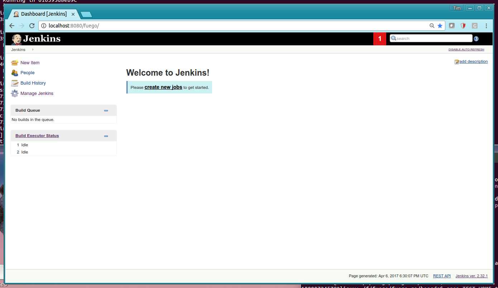

.. _jenkins_ui:

#######################
Jenkins User interface
#######################

By default, Fuego uses the Jenkins continuous integration system to
manage boards, tests, logs, and test results.

The Jenkins user interface is web-based.  This page shows several
screenshots of different pages in the Jenkins interface.

Through this interface, you can see the status of tests that have run,
review the logs for tests, and schedule new tests to run on target
boards.  You also use this interface to add new boards and new tests
to the system.

Note that Jenkins objects are:

 * nodes
 * jobs
 * builds
 * views

These are different from the Fuego names for the same objects.  The
first three of these Jenkins objects correspond to the Fuego objects
of: **boards**, **tests** and **runs**, respectively.

==================
Main dashboard
==================

The main dashboard of Jenkins looks like the following:

New Installation
====================

When Fuego has just been installed, there is nothing in the Jenkins
interface (no nodes, jobs or views). The interface should look
something like this:

With a single node (board) added
===================================

Here is the main dashboard of Jenkins, after a single node (called
'beaglebone' in this case) has been added.  Note the node (board)
appears in the left sidebar under "Build Executor Status":

With beaglebone node and jobs
=================================

Here is the main dashboard of Jenkins, showing a single node
(beaglebone) and jobs for this board.

.. image:: ../images/fuego-1.1-jenkins-dashboard-beaglebone-jobs.png
   :width: 900

Dashboard with jobs in Build Queue
===================================

Here is the Jenkins dashboard with a lot of jobs in the Build Queue.
Note the list of jobs in the left side-bar, in the "Build Queue" pane.

==============
Node pages
==============

If you click on the node in the **Build Executor Status** pane, then
you can see a list of the jobs associated with a node.

Node status page
=======================

Here is the status for the beaglebone node.

==============
Job pages
==============

If you click on a job in the Jenkins interface, you can see
information about an individual job. This page shows information about
the status of the job, including a Build History for the job (in the
left sidebar).

You can start a job by clicking on the "Build Now"  button in the left
menu.

Functional job status page
=================================

Here is a page showing the status information for a Functional test
called 'hello_world'.  The main area of the screen has information
about the last successful and failed builds of the test.  Note the
left sidebar pane with "Build History", to see individual test
execution results.

Benchmark job - starting a build
=====================================

Here is a picture of a job build being started.  Note the progress bar
in the **Build History** pane in the left sidebar.

Benchmark job - before successful execution
================================================

Before a Benchmark job completes it has no data to plot on it's chart,
and appears similar to a Functional Job status page:

Benchmark job - with plot of metrics
========================================

Normally, a Benchmark page shows one or more plots showing the values
for data returned by this benchmark.

===============
Build pages
===============

A build page shows the results of a single execution of a job (test)
on a board.  You can click on the build number in the Jenkins
interface to see this page.

Results from a job build
==============================

Here are the results from the execution of the "hello world" job.
This was the results of running the Fuego test
"Functional.hello_world" on a beaglebone board.

Test log results
====================

You can examine the different logs for each test.  Each test produces
a log from the program that ran on the board.  This is available by
following a link called "log" from the 'build' page for that test run.
You can see the console log, which shows the output of commands for
this test, by clicking on "console log" in the build interface (or the
build drop-down menu in the **Build History** list).

Drhystone test log
--------------------------

Here are results from a run of the Dhrystone test on a beaglebone
board:

Jenkins Console log
---------------------

Here is the console log for a test executed on the beaglebone:

==============
View pages
==============

A **view** is an area in the main dashboard that shows a collection
of jobs with a particular set of status columns for each job.  They
appear as tabs in the main dashboard view of Jenkins.  You can create
your own view to see a subset of the jobs that are available in
Jenkins

Here are some screen shots showing how to add a new view to Jenkins.

Screen to add a new view
==============================

Here is the screen to add a new view to Jenkins.

Screen to configure the view settings
===========================================

Here is the screen to configure view settings.  Note the use of a
regular expression to control what jobs to see in this view.  You can
also control what status columns to display in the view.

=======================
Other Jenkins pages
=======================

Build History
==================

The global build history page is available by clicking on the **Build
History** link in the main dashboard page of Jenkins.  It shows the
execution time and status for a recent time period.

Jenkins management
=======================

You can manage Jenkins using the **Manage Jenkins** page, available
from the top-level dashboard page in Jenkins.  From here you can
update Jenkins itself, install or remove plugins, and perform other
management operations for Jenkins.

