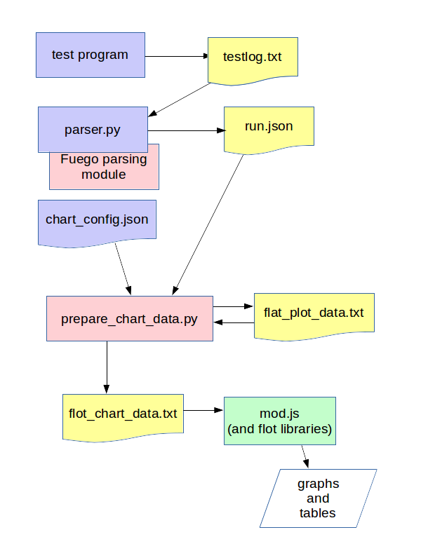

#######################
Jenkins Visualization
#######################

Fuego test results are presented in the Jenkins interface via a number
of mechanisms.

===========================
Built-in Jenkins status
===========================

Per-job data
============
Jenkins automatically presents the status of the last few tests (jobs)
that have been executed, on the job page for those jobs.

A list of previous builds of the job are shown in the left-hand pane
of the page for the job, showing colored balls indicating the test
status.  A green ball indicates that the test passed, and a red
ball indicates that the test failed.

Build history
=============
Jenkins can also show "Build History" pages for all tests, for the tests
in a particular view, or for the tests for a particular node.
The build history page for each of these selections will show a timeline
chart with balls and job names indicating the time and status for those
tests, as well as a status table indicating the results for the
indicated set of items (all builds, or builds associated with a node
or a view)

The build history can be dragged left or right to see different
time periods of the build results. Drag the top portion of the
graph to drag by days, and the bottom portion to drag by hours.

==============================
flot plugin for Fuego results
==============================

On the right side of the page for a job is an area where a chart (graph or
table) will appear.  Fuego uses a plugin (called 'flot') that it installs
in Jenkins to provide visualization of Fuego test results.

For benchmarks, the results are shown as plots (graphs) of measure data,
and for functional tests, tables are shown with either individual
results for each testcase, or summary data for the testsets in the test.

See :ref:`flot` for more information.

====================
Charting details
====================

Fuego results charts consists of either plots (a graph of results
versus build number) or tables (a table of results versus build
number).

There are 4 different chart output options:

 1) A plot of benchmark measures (called "measure_plot")
 2) a table of benchmarks measures and reference values (called "measure_table")
 3) A table of testcase results (called "testcase_table")
 4) A table of testcase summary counts per testset (called "testset_summary_table")

A user can control what type of visualization is used for a test using
a file called :ref:`chart_config.json`.  This file is in the test
directory for each individual test.  See the wiki page for that file
for additional details.

Scope of data displayed
============================

By default, the page for a particular job shows the data for all of
the specs and boards related to the test. This can be confusing, but
it allows users to compare results between boards, and between
different test specs for the same test.

For example, a job that runs the test Benchmark.bonnie, using the
'default' test spec job (e.g. board1.default.Benchmark.bonnie) shows
results for:

 * Boards: board1, and also other boards
 * Specs: default, noroot
 * Measures: (the ones specified in ``chart_config.json``)

=============================
Detailed chart information
=============================

Internally, output (by the :ref:`flot` module) is controlled by a file
called: ``flot_chart_data.json``

Inside that, there is a data structure indicating the configuration
for one or more charts, called the chart_config.  This is placed there
during chart processing, by the results parser system.  A section of
that file, the chart_config element, is a direct copy of the data from
``chart_config.json`` that comes from the test directory for the test.

Information flow
======================

The internal module ``prepare_chart_data.py`` is used to generate
``flat_plot_data.txt``.  The data in this file is stored as a series of
text lines, one per result for every testcase in every run of the
test.  This file is stored in the top level log directory for a
test. For example
``/fuego-rw/logs/Functional.hello_world/flat_plot_data.txt`` has the
"flattened" test results for all runs of the 'hello_world" test.

This file is then used to create a file called ``flot_chart_data.json``,
which has the data pre-formated as either 'flot' data structures, or
HTML tables.

A file called ``chart_config.json`` is used to determine what type of
charts to include in the file, and what data to include.

Here's a diagram of this data flow:

.. note::
   Programs are in rectangles, and data files are the shapes with a
   curved bottom line.  Items that are part of a test are in light purple.
   Items that are part of the Fuego parsing core are in light red. And
   the items in Javascript (or Jquery) that are integrated into Jenkins
   are in green.

The flot program ``mod.js`` is used to draw the actual plots and tables
based on ``flot_chart_data.json``.  ``mod.js`` is included in the web page for
the job view by Jenkins (along with the base flot libraries and jquery
library, which flot uses).

measure_plot
===============

A measure_plot is a graph of measures for a benchmark, with the
following attributes: ::

  title=<test>-<testset>
  X series=build number
  Y1 series=result
  Y1 label=<board>-<spec>-<test>-<kernel>-<tguid>
  Y2 series=ref
  Y2 label=<board>-<spec>-<test>-<kernel>-<tguid>-ref

It plots measures (y) versus build_numbers.

Here's example data for this: ::

 "charts": [
    {  # definition of chart 1
      "title": "Benchmark.fuego_check_plots-main.shell_random"
      "chart": {
         "chart_type": "measure_plot",
         "data": [
           {
              "label": "min1-default_spec-Benchmark.fuego_check_plots-v4.4-main.shell_random",
              "data": [ ["1","1006"],["2","1116"] ],
              "points": {"symbol": "circle"}
           },
           {
              "label": "min1-default_spec-Benchmark.fuego_check_plots-v4.4-main.shell_random-ref",
              "data": [ ["1","800"],["2","800"] ],
              "points": ["symbol":"cross"}
           }
         ]
         # note: could put flot config object here
      }
  }
 ]

measure_table
===================

A measure_table is a table of test spec with the following attributes:

 * row=(one per line with matching testspec/build-number in flat_chart_data.txt)
 * columns=test set, build_number, testcase value, testcase ref value, testcase
   result(PASS/FAIL), duration
 * Sort rows by testspec, then by build_number

Here was the format of the first attempt: ::

  title=<board>-<test>-<spec> (kernel)
  headers:
     board:
     kernel(s):
     test spec:
  ---------------------------------------------------------------
                            |    build number
  measure items  | test set |   b1   |   b2   |   b3   |   bN   |
  X1             |  <ts1>   | value1 | value2 | value3 | valueN |
  X1(ref)        |  <ts1>   | ref(X1)| ref(X1)| ref(X1)| ref(X1)|
  <bn>           |  <ts2>   |                ...
    (row-span    |  <ts2>   |                ...
  as appropriate)|  <ts3>   |                ...
  <b2n>          |  <ts3>   |                ...

And, 'valueN' is displayed in a correct color, e.g. GREEN if value1 is
in the expectation interval specified by 'ref', otherwise in RED, so
that we can display more info in a chart.

testcase_table
====================

A testcase_table is a table of testcases (usually for a functional
test), with the following attributes: ::

   overall title=<board>-<test>-<spec>
   header:
     board
     test set
     kernel version
   --------------------------------------------
   test case | results               |
             | build_number          |
             | b1    | b2    | bn    |
   <tguid1>  |result1|result2|resultn|
   <tguid2>  |result1|result2|resultn|
        totals
   pass: |    |    |    |
   fail: |    |    |    |
   skip: |    |    |    |
   error:|    |    |    |
   --------------------------------------------

testset_summary_table
==========================

A testset_summary_table is a table of testsets (usually for a complex
functional test) with the following attributes:

 * row=(one per line with matching testset/build-number in flat_chart_data.txt)
 * columns=test set, build_number, start_time/timestamp, testset pass count, testset fail count, duration
 * Sort rows by testset, then by build_number

::

  title=<board>
  headers:
     board:
     kernel(s):
  -----------------------------------------------------
                            |    counts
  build number   | test set | pass | fail| skip | err |
  <bn>           |  <ts1>   |
    (row-span    |  <ts2>   |
  as appropriate)|  <ts3>   |
  <b2n>          |  <ts1>   |
                 |  <ts2>   |

It shows testset summary results by runs

Structure of chart_data.json
==================================

Here's an example: ::

 {
  "chart_config": {
     "type": "measure_plot"
     "title:": "min1-Benchmark.fuego_check_plots-default"
     "chart_data": {
        data
 }

============================
Planned for the future
============================

In future releases of Fuego, additional chart types are envisioned:

A fifth chart type is:

  5) A plot of testcase summary counts per testset (called testset_summary_plot)

testset_summary_plot
==========================

A testset_summary_plot is a graph of testsets (usually for a complex
functional test) with the following attributes: ::

  title=<board>-<spec>-<test>-<kernel>
  X series=build number
  Y1 series=pass_count
  Y1 label=<board>-<spec>-<test>-<kernel>-<testset>-pass
  Y2 series=fail_count
  Y2 label=<board>-<spec>-<test>-<kernel>-<testset>-fail

It graphs testset summary results versus build_ids

Feature deferred to a future release
========================================

 * Ability to specify the axes for plots in chart_config
 * Ability to specify multiple charts for a single result data set in chart_config

========================================
Architecture for generic charting
========================================
This section has notes about how the current data and structures can be
manipulated in a generic way to generate charts with different layouts
and fields.  This is for reference for future implementation of
additional chart types in the future.

Assuming you have a flat list of entries with attributes for
board, testname, spec, tguid, result, etc., then you can use treat this like
a sql database, and do the following:

 * Make a list of charts to build

   * Have a chart-loopover-key = type of data to use for loop over charts
   * Or, specify a list of charts

 * Define a key to use to extract data for a chart (the chart-key)
 * For each chart:

   * Make a list of rows to build

     * Have a row-loopover-key = filter for rows to include
     * Or, specify a list of rows

   * Define a key to use to extract data for each row
   * If sub-columns are defined:

     * Make a sub-column-key
     * Make a two-dimensional array to hold the sub-column data

   * For each entry:

     * Add the entry to the correct row and sub-column

   * Sort by the desired column
   * Output the data in table format

     * Loop over rows in sort order
     * Generate the html for each row

       * Loop over sub-columns, if defined

   * Return html

There's a similar set of data (keys, looping) for defining plot data,
with keys selecting the axes.
