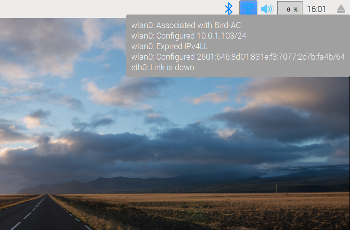
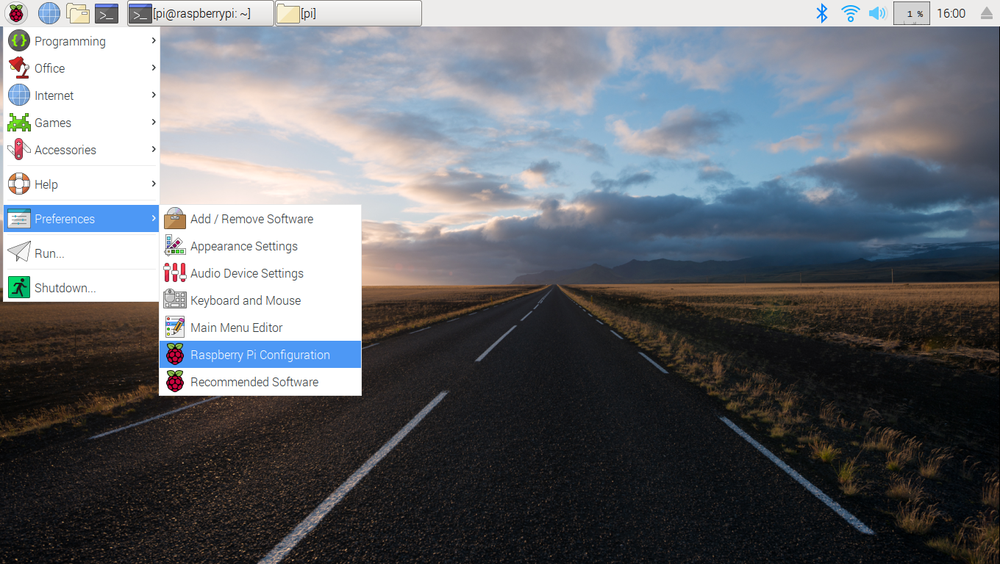
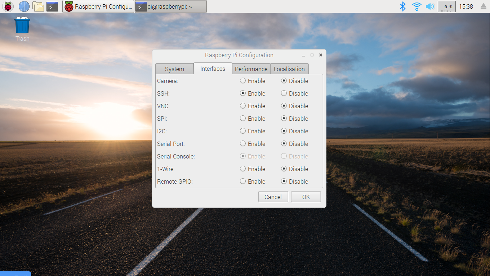

.. _raspPiFuegoSetup:

#########################
Raspberry Pi Fuego Setup
#########################

This is a list of instructions for setting up a Raspberry Pi board
for use with Fuego.  These instructions will help you set up the
ssh server, used by Fuego to communicate with the board, and the 
test directory on the machine, that Fuego will use to store programs
and files during a test.

These instructions and the screen shots are for a Raspberry Pi Model 3 B,
running "Raspbian 9 (stretch)".

This assumes that the Raspberry Pi is already installed, and that
networking is already configured and running.

==============================
Obtain your network address
==============================

First, determine what your Pi's network address is.  You can see this by using
the command 'ifconfig' in a terminal window, and checking for the 'inet' address.

Or, move your mouse cursor over the network icon in the desktop panel bar.
If you leave the mouse there for a second or two, a box will appear showing
information about your current network connection.

This is what the network information box looks like (in the upper right corner
of this screen shot):

In this case, my network address is 10.0.1.103.
Your address might start with 192.168, which is common for home or local networks.

Note this address for use later.

==========================
Configure the SSH server
==========================

In order for other machines to access the Pi remotely, you need to
enable the ssh server.

This is done by enabling the SSH interface in the Raspberry Pi Configuration
dialog.

To access this dialog, click on the raspberry logo in the upper right corner
of the main desktop window.  Then click on "Preferences", then on
"Raspberry Pi Configuration".  In the dialog that appears, click on the
"Interfaces" tab, and on the list of interfaces click on the "Enable"
radio button for the SSH interface.

Here is the menu:

The configuration dialog looks something like this:

Try connecting
================

Now, close this dialog, and make sure you can access the Pi using
SSH from your host machine.

Try the following command, from your host machine:

 * ssh pi@<''your_address''>

You will be asked for the password for the 'pi' user account.

If you successfully log in, you will be at a shell prompt.

Configure sshd for root access (if applicable)
================================================

If you intend to execute Fuego tests as root, you should configure
the SSH server to permit root login.

This is not recommended on machines that are in production, as it is
a significant security risk.  However, for test machines it may be
acceptable to allow root access over ssh.

To do this, on the Raspberry Pi, with root permissions, edit the file /etc/ssh/sshd_config
and add the following line: ::

   PermitRootLogin yes

.. Note::

    You need to stop and start the ssh server, or reboot the board,
    in order to have this new configuration take effect.''

========================
Make a test directory
========================

You can use any directory you like for executing tests from Fuego.
However, we recommend using the '/home/fuego' directory.
These instructions indicate how to create that directory.

If you are using root as your test user account, then create
a directory on the Raspberry Pi for test programs and files.

If logged in as the 'pi' account, then switch to root (using
something like 'sudo su'), and type,
at a shell prompt:

``$ mkdir /home/fuego`` 

If you do not wish to use the root account for testing, then
you should create a 'fuego' account for testing.  To do this,
use the 'adduser' program.  You will be prompted for some
information.

``$ adduser fuego``

Answer the questions, including setting the password for this
account. Remember the password you select, and use that in the board
file when configuring Fuego to access this board.

This will create the directory ``/home/fuego``.

The directory ``/home/fuego`` is what should be used in
the board file when configuring Fuego to operate with this board.

============================
Add the board file to Fuego
============================

Now that you have set up the Raspberry Pi board, add the board file to
Fuego.  Assuming your IP address is 10.0.1.17, and you wish to log in
as root, you would create a board file 
called "rpi.board", and located at ::

   <fuego-top-dir>/fuego-ro/boards/rpi.board

with the following contents: ::

	inherit "base-board"
	include "base-params"

	IPADDR="10.0.1.17"
	LOGIN="root"
	BOARD_TESTDIR="/home/fuego"
	PASSWORD="put-the-root-password-here"
	TOOLCHAIN="debian-armhf"
	TRANSPORT="ssh"
	ARCHITECTURE="arm"
	FUEGO_TARGET_TMP="/home/fuego"

.. Note::

    Of course, use the correct root password for your board

==================================
Add the toolchain to Fuego
==================================

The Raspbery Pi board is an ARM 32-bit platform.

Add the 'debian-armhf' toolchain to the Fuego docker container, using
the helper script in the fuego-ro/toolchains directory.

Inside the Fuego container, run: ::

  $ /fuego-ro/toolchains/install_cross_toolchain.sh armhf

========================================
Add a node and jobs for the board
========================================

Inside the Fuego container, run: ::

  $ ftc add-node -b rpi

Add the tests you want to run, as Jenkins jobs.  You should always
add the "fuego_board_check" test, as a way to automatically determine
that status of a board.

Inside the Fuego container, run: ::

  $ ftc add-job -b rpi -t Functional.fuego_board_check

An easy way to populate Jenkins with a set of tests is to install a batch test.

Install the "smoketest" batch test, as follows:

Inside the Fuego container, run: ::

  $ ftc add-jobs -b rpi -t Functional.batch_smoketest

=============================
Run a board check
=============================

To see if everything is set up correctly, execute the test:
Functional.fuego_board_check.

In the Jenkins interface, select "rpi.default.Functional.fuego_board_check"
and select the menu item "Build Now" on the left hand side of the screen.

Wait a few moments for the test to complete. when the test completes, check
the log for the test by clicking on the link to the 'testlog'.

